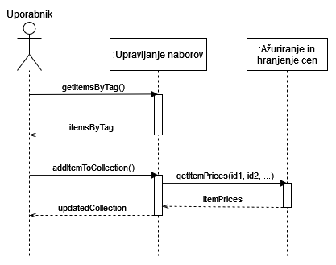

# Primerjalnik cen izdelkov
**Avtor**: Mihael Rajh (skupina 72)

**Opis projekta**: Namen izdelane aplikacije je primerjava cen izdelkov med različnimi trgovinami. Uporabnikom med drugim omogoča izbiro priljubljenih izdelkov in sestavo poljubnih košaric oziroma naborov izdelkov. Cene se lahko primerjajo bodisi za posamezen izdelek, ali pa za košarice v celoti.

**Razvojno okolje**: Pri izdelavi projekta je bilo uporabljeno Javansko ogrodje KumuluzEE, Apache Maven in Docker tehnologija. Pri razvoju so bili uporabljeni IDE IntelliJ IDEA Ultimate, Docker Desktop in Postman. Za namestitev so bili uporabljeni GitHub Actions, Docker Hub in Microsoft Azure.


## Arhitektura mikrostoritev


### Opis mikrostoritev

| Mikrostoritev        | Ažuriranje in hranjenje cen                                  |
| -------------------- | ------------------------------------------------------------ |
| Opis funkcionalnosti | Primarni cilj mikrostoritve je hranjenje cen izdelkov v podatkovni bazi in strežba podatkov aplikacijam, ki te informacije potrebujejo. Sekundarni cilj mikrostoritve je iskanje in posodabljanje cen glede na ažurno stanje izbranih trgovinskih spletnih strani. |
| GitHub               | [mtn-rso-price-compare/price-updater](https://github.com/mtn-rso-price-compare/price-updater) |
| Docker Hub           | [mikethenut/price-updater](https://hub.docker.com/repository/docker/mikethenut/price-updater) |
| Odvisnosti           | /                                                            |
| Metrike              |                                                              |
| API vmesnik          | */item*: Podatki o vseh izdelkih v bazi (**GET**).<br>*/item/{itemId}*: Podatki o cenah artikla {itemId} (**GET**).<br>*/store*: Podatki o vseh trgovinah v bazi (**GET**).<br>*/store/{storeId}*: Podatki o trgovini {storeId} in njihovih izdelkih (**GET**).<br>*/request*: Ukazi za takojšnje ažuriranje cen (**GET, POST**).<br>*/request/{requestId}*: Podatki o izvedbi ukaza za ažuriranje cen (**GET**). |


| Mikrostoritev        | Upravljanje naborov                                          |
| -------------------- | ------------------------------------------------------------ |
| Opis funkcionalnosti | Mikrostoritev je namenjena hranjenju podatkov o naborih izdelkov uporabnika, imenovani košarice. Hrani tudi podake o kategorijah izdelkov, ki predstavljajo ločeno vrsto naborov. Mikrostoritev omogoča poizvedbe za celotne nabore glede na cene, ki jih vrača Ažuriranje in hranjenje cen. |
| GitHub               | [mtn-rso-price-compare/collection-manager](https://github.com/mtn-rso-price-compare/collection-manager) |
| Docker Hub           | [mikethenut/collection-manager](https://hub.docker.com/repository/docker/mikethenut/collection-manager) |
| Odvisnosti           | Ažuriranje in hranjenje cen (mikrostoritev)                  |
| Metrike              |                                                              |
| API vmesnik          | */collection*: Podatki o vseh nakupovalnih seznamih (**GET, POST**).<br>*/collection/{collectionId}*: Podatki o nakupovalnem seznamu {collectionId} (**GET, POST, PUT, DELETE**).<br>*/collection/{collectionId}/{itemId}*: Izdelek {itemId} na nakupovalnem seznamu {collectionId} (**DELETE**).<br>*/tag*: Seznam vseh oznak izdelkov v bazi (**GET, POST**).<br>*/tag/{tagId}*: Podatki o izdelkih z oznako {tagId} (**GET, POST, PUT, DELETE**).<br>*/tag/{tagId}/{itemId}*: Izdelek {itemId} z oznako {tagId} (**DELETE**). |


## Primeri uporabe

- Uporabniki lahko primerjajo cene izdelkov med trgovinami.
- Uporabniki lahko ustvarijo poljubne nabore izdelkov, ki se imenujejo nakupovalni vozički.
- Uporabniki lahko primerjajo skupno ceno svojih nakupovalnih vozičkov med trgovinami.
- Uporabniki lahko označijo izdelke kot priljubljene.
- Uporabniki lahko pregledajo svoje priljubljene izdelke in jih po želji odstranijo s seznama priljubljenih.
- Uporabniki lahko primerjajo skupno ceno svojih priljubljenih izdelkov med trgovinami.

### Primer napredne uporabe

Uporabnik želi dodati predmet iz določene kategorije na svoj nakupovalni seznam. Najprej zahteva pregled izdelkov iz določene kategorije, ki jih vrne mikrostoritev `Upravljanje naborov`. Nato enega izmed izdelkov doda na svoj seznam, pri čemer najprej `Upravljanje naborov` shrani spremembo, nato pa od mikrostoritve `Ažuriranje in hranjenje cen` zahteva cene vseh izdelkov na seznamu. S tem potrdi obstoj dodanega izdelka, hkrati pa lahko uporabniku vrne podatke o cenah za celoten seznam.




## Diagram ER


## Primeri objektov JSON 

#### /item

```json
{
    item_id:36,
    item_name:"piščančje prsi",
    price: [
    	{
    	    store_id:2,
    	    amount:7.3,
    	    last_updated:"2022-11-13T12.05"
    	},
    	{
    	    store_id:3,
    	    amount:7.6,
     	    last_updated:"2022-11-13T12.05"
    	}
    ]
}
```

Atribut 'price' je privzeto vrnjen le za zahtevke na določen item ID.

#### /store

```json
{
    store_id:1,
    store_name:"ENGROTUŠ d.o.o.",
    url:"https://www.tus.si"
    price: [
    	{
    	    item_id:36,
    	    amount:7.3,
    	    last_updated:"2022-11-13T12.05"
    	},
    	{
    	    item_id:27,
    	    amount:5.9,
     	    last_updated:"2022-11-13T12.05"
    	}
    ]
}
```

Atribut 'price' je privzeto vrnjen le za zahtevke na določen store ID.

#### /request

```json
{
    request_id:7,
    status:"SUCCESS",
    last_updated:"2022-11-13T12.05"
}
```

#### /collection

```json
{
    collection_id:9,
    user_id:2,
    collection_name:"Shopping list",
    item: [
        {
    	    item_id:36,
    	    item_name:"piščančje prsi",
         	amount:2,
        	price: [
            	{
                	store_id:2,
                	amount:7.3,
                	last_updated:"2022-11-13T12.05"
            	},
            	{
               		store_id:3,
                	amount:7.6,
                	last_updated:"2022-11-13T12.05"
            	}
            ]
        },
        {
            item_id:27,
            item_name:"sir Parmigiano Reggiano",
            amount:1,
            price: [
            	{
                	store_id:2,
                	amount:5.6,
                	last_updated:"2022-11-13T12.05"
            	},
            	{
               		store_id:3,
                	amount:5.2,
                	last_updated:"2022-11-13T12.05"
            	}
            ]
        }
    ],
    price_total: [
        {
            store_id:2,
            amount:20.2
        },
        {
            store_id:3,
            amount:20.4
        }
    ]
}
```

#### /tag

```json
{
    id:3,
    tag_name:"Meso in mesni izdelki",
    item: [
        {
    	    id:36
    	    item_name:"piščančje prsi"
        },
        {
            id:25,
            item_name:"svinjska rebra"
        }
    ]
}
```

